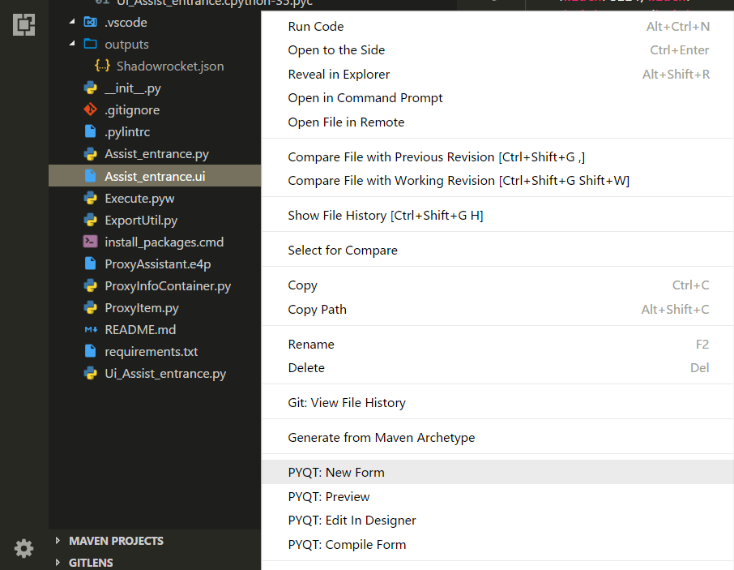

# PySide2 - VSC
<!--
[](https://marketplace.visualstudio.com/items?itemName=zhoufeng.pyside2-vsc) [](https://marketplace.visualstudio.com/items?itemName=zhoufeng.pyside2-vsc) [](https://marketplace.visualstudio.com/items?itemName=zhoufeng.pyside2-vsc)
-->
An extension to help with coding Qt for Python (PySide2) projects in VS Code. Provides handy commands for processing Qt's UI and resource files.
<!--

-->

## Explorer context menu
New VS Code file-explorer context menu options:

|No.|Name|Description|
|:---:|---|---|
|1|PySide2: New Form|Open designer/creator with a new form/widget|
|2|PySide2: Edit In Designer|Open designer/creator with the current ui form|
|3|PySide2: Preview|Preview current ui form|
|4|PySide2: Compile Form|Compile ui form to the python file defined by the pattern in "`pyside2-vsc.uic.compile.filepath`"|
|5|PySide2: Compile Resource|Compile qrc resource to the python file defined by the pattern in "`pyside2-vsc.rcc.compile.filepath`"|

## Properties
Important properties available for customization:

|No.|Name|Description|
|:---:|---|---|
|1|`pyside2-vsc.designer-creator.path`|Path to QtCreator or QtDesigner for visually building .ui files (Will be prompted the first time you try to use it)|
|2|`pyside2-vsc.uic.cmd`|Command to compile a .ui file into python code, default "`pyside2-uic`"|
|3|`pyside2-vsc.uic.compile.filepath`|Pattern defining where compiled forms should be placed, e.g. \${workspace}\\\\UI\\\\Ui_\${ui_name}.py|
|4|`pyside2-vsc.uic.compile.addOptions`|Additional command line options for the pyside2-uic program|
|5|`pyside2-vsc.rcc.cmd`|Command to compile a .qrc file into python code, default "`pyside2-rcc`"|
|6|`pyside2-vsc.rcc.compile.filepath`|Pattern defining where compiled resourced should be placed, e.g. \${workspace}\\\\QRC\\\\\${qrc_name}_rc.py|
|7|`pyside2-vsc.rcc.compile.addOptions`|Additional command line options for the pyside2-rcc program|

```text
Compilation will overwite the target py file without confirmation!
```